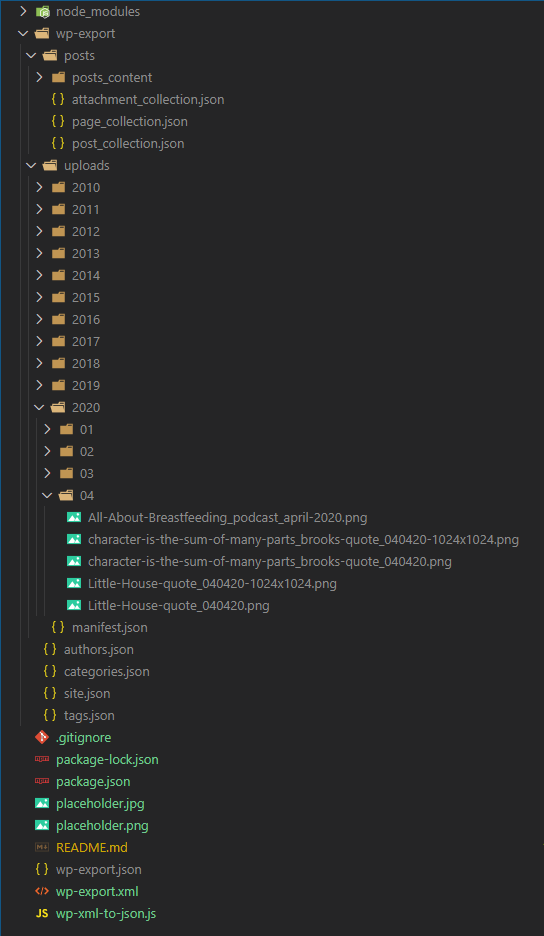
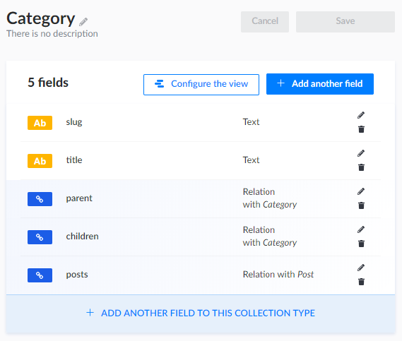
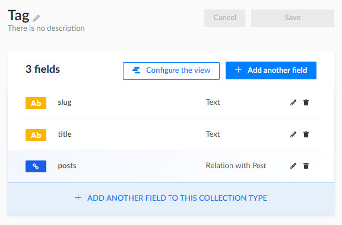
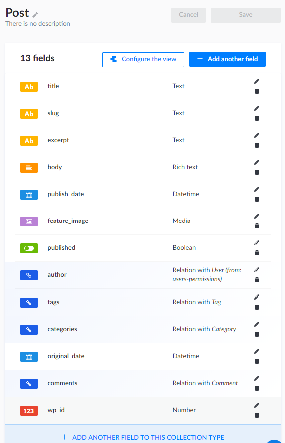

# wordpress-2-strapi

The purpose of this repo is to enable moving content from the kristinacowan.com wordpress website, to a Strapi headless cms repository.
WordPress websites vary greatly, it doesn't make sense to try to create one utility to do it all (especially since Strapi doesn't have an api for creating content types).
WordPress websites an have dozens, even hundreds of custom content types, plugins, and themes. Furthermore, some WordPress websites have their content riddled with shortcodes. Each website needs to be looked at individually to see what makes sense to convert, and what doesn't.

For [kristinacowan.com](https://kristinacowan.com), the WordPress site leverages a few shortchodes, a dozen or so plugins, and is primarily made up of pages and posts (with comments and attachments). The pages will be re-created in Strapi, but posts should come over as-is.

Here are some of the requirements:

- All images and files related to posts should be migrated
- URLs inside the content that point to local WordPress endpoints need to be converted to their new Strapi endpoints.
- Posts should retain their feature images as applicable
- Content should be converted to markdown
- The code is `throw-away` code, to be used only for the migration itself, but while we are testing the migration, it should be able to be run sequentially as many times as needed without breaking things or duplicating content inside Strapi.

**Note:** This is not a library intended to service the masses, it was written in an afternoon specifically to support the migration of a specific website, and it may not work on other websites as currently designed. Use at your own risk, but source code is provided in case it's useful to someone attempting to accomplish the same thing or similar.

## Directions

Export the full wordpress xml file to a local file called `wp-export.xml` in the root of this repository.

Fill in the `.env` file at the root of the project (a sample `.env` is provided.)

## Convert the xml to json and download all images

```bash
npm run wp-export-to-json
```

The command above does 3 things:

- Creates a `wp-export` directory with a json representation of all the content of your WordPress site
- Generates a `markdown` representation of all posts with the post type 'post'
- Downloads all `post` images to the `uploads` directory matching the `uploads` path structure from WordPress

### Example



### Post Json

The JSON of the post contains category ids pointing back to the categories (in the `categories.json` file), tag ids,
important metadata, markdown version of the content, embedded content, embedded excerpt, embedded urls, and more, etc...

```
  {
    "id": 75,
    "title": "An Emotional Walk of Faith",
    "slug": "an-emotional-walk-of-faith",
    "link": "https://www.kristinacowan.com/2011/05/11/an-emotional-walk-of-faith/",
    "guid": "http://kristinacowan.com/?p=75",
    "status": "publish",
    "postDate": "2011-05-12T04:55:25.000Z",
    "pubDate": "2011-05-12T04:55:25.000Z",
    "creator": "kristinacowan",
    "creatorId": 2,
    "markdown": "One of my oldest friends and I have built ourselves an oasis. Every Thursday night, after our impish toddlers have scampered off to bed, we call each other. We recap the week, revisit college days and our mutual interest in royal weddings, and delve into our latest challenges as career women and moms. It's an emotionally rejuvenating time when we escape life's fray. By analyzing and reflecting, we help each other through life's thorny patches and celebrate our joys. A recurring conversation we have focuses on how choices of early motherhood are so emotionally charged--particularly our decisions around how much time we devote to our children and careers. She works full-time as an attorney, while I work from home part-time, as a writer. For both of us, the choices have been difficult. While she utterly loves her work and excels at it, she also feels the tug of balancing everything at home, of wanting to spend more time with her family. I too face these conflicts. There's nothing I'd rather be doing than chasing a story, and I wonder if I'm working enough to stay relevant--though I believe my decision to scale down my work, for now, has been the right path for my family. While musing over the juggling, we agree that, to some degree, it's emotionally easier to return to work full-time than it is to stay home. Why? Because our careers are known entities: comfortable arenas where we enjoy camaraderie, growth and a sense of accomplishment. Our children are akin to the Wild West--unknown, especially at first. They're always changing, often pushing us beyond our comfort zones, and testing our endurance and patience in ways that are sometimes maddening. Toddlers and infants make for strange companions, and caring for them is often thankless. [Jill Savage](http://www.jillsavage.org/), author, speaker, and chief executive of Hearts at Home, says that for women who launch into motherhood in their 30s and 40s, the identity shift is tricky:\n\n> I think a woman who does have 10-15 years under her belt, where she’s identified as a journalist, teacher, etc., it's an even harder journey for her to make that transition to identifying herself as a mom--and find that as an acceptable, even a strong, identity. ... The simple act of the job of full-time motherhood is very thankless. It has no sense of accomplishment, and really everything a mom does gets undone \\[changing diapers, making beds, doing laundry\\]. Everything we do as moms never gets accomplished; that’s why there’s so much satisfaction for women in a job outside the home, because they get a sense of accomplishment from it.\n\nIn the first days after my son Noah was born, it seemed as if a door had slammed shut on my previous life. In the not-so-old days, I traveled on assignment and tackled tough stories, relished cozy dinners with my husband and long, inspiring chats with friends. I knew freedom and independence. My biggest responsibilities were to my husband, and I felt I was managing them well. My new life presented a stark and unfriendly contrast, echoing with the constant, tedious din of feedings, diaper changing and interrupted sleep. My biggest responsibility loomed like a goliath: A human being who was entirely reliant on me for everything, it seemed, except his breath. The mother-child tie binding me was every bit as terrifying as it was amazing. What if I failed? I could think only in 24-hour increments--wondering what he would be like as a 5-year-old, for example, overwhelmed me. I decided I wasn't comfortable with this brave new world of parenthood. I wanted to return to my old existence, because I could thrive there. My initiation into motherhood felt unnatural and unfriendly. Surely God had screwed up--what was he thinking by giving me the gift of a new life to shepherd? I didn't deserve it. That was my outlook in the spring of 2009. Granted, it was a mindset muddled by immense sleep-deprivation and terribly imbalanced hormones, including a failing thyroid, and the aftershock of a [physically grueling labor](http://kristinacowan.com/2011/05/24/when-i-have-fears/). But these were my thoughts and feelings. Our thoughts and feelings change, fortunately, and they're not always indicative of who we are. A week after Noah's birth my brother called to find me sobbing, and he reasoned with me, \"This isn't _who_ you are. It's _where_ you are.\" He was right--thank God. More than two years later, I'm no longer there, in the quagmire. Motherhood is a big part of my identity, to be sure, a part where I spend much of my time these days. I've grown to appreciate it more, but it doesn't entirely define me. I'm still the writer, the reporter, the wife and the friend, the sister and the aunt. I've come to believe that God doesn't intend for our circumstances to define us, though we easily get stuck in a rut of thinking that way. Our identities in Christ are far more dynamic than where we are. If we hand the reins over to him, he works everything out for good--even the very worst of times. He leads us beyond the valleys of \"where\" to much higher, more satisfying ground, and it's there that we clearly see \"who\" he intended us to be. Motherhood is an emotional walk of faith. It's a great opportunity for handing our lives over to the one who gave his life for us--whether we're working in an office full-time, staying home full-time, or somewhere in between. He's the only one, I've learned, who can keep me sane in the wild-and-wonderful world of parenting.\n\n*   [Jill Savage's website](http://www.jillsavage.org/)\n*   [Chris Fabry Live: May 9 broadcast on not allowing circumstances to define us](http://asxarchive.moodyradio.org/ChrisFabryLive/2011-05-09_Chris_Fabry_Live__hour_01.asx)",
    "urls": [
      "http://www.jillsavage.org",
      "http://kristinacowan.com/2011/05/24/when-i-have-fears/",
      "http://asxarchive.moodyradio.org/ChrisFabryLive/2011-05-09_Chris_Fabry_Live__hour_01.asx"
    ],
    "encodedContent": "One of my oldest friends and I have built ourselves an oasis. Every Thursday night, after our impish toddlers have scampered off to bed, we call each other. We recap the week, revisit college days and our mutual interest in royal weddings, and delve into our latest challenges as career women and moms. It's an emotionally rejuvenating time when we escape life's fray. By analyzing and reflecting, we help each other through life's thorny patches and celebrate our joys.\n\nA recurring conversation we have focuses on how choices of early motherhood are so emotionally charged--particularly our decisions around how much time we devote to our children and careers. She works full-time as an attorney, while I work from home part-time, as a writer. For both of us, the choices have been difficult. While she utterly loves her work and excels at it, she also feels the tug of balancing everything at home, of wanting to spend more time with her family. I too face these conflicts. There's nothing I'd rather be doing than chasing a story, and I wonder if I'm working enough to stay relevant--though I believe my decision to scale down my work, for now, has been the right path for my family.\n\nWhile musing over the juggling, we agree that, to some degree, it's emotionally easier to return to work full-time than it is to stay home. Why? Because our careers are known entities: comfortable arenas where we enjoy camaraderie, growth and a sense of accomplishment. Our children are akin to the Wild West--unknown, especially at first. They're always changing, often pushing us beyond our comfort zones, and testing our endurance and patience in ways that are sometimes maddening. Toddlers and infants make for strange companions, and caring for them is often thankless. <a href=\"http://www.jillsavage.org/\">Jill Savage</a>, author, speaker, and chief executive of Hearts at Home, says that for women who launch into motherhood in their 30s and 40s, the identity shift is tricky:\n<blockquote>I think a woman who does have 10-15 years under her belt, where she’s identified as a journalist, teacher, etc., it's an even harder journey for her to make that transition to identifying herself as a mom--and find that as an acceptable, even a strong, identity. ... The simple act of the job of full-time motherhood is very thankless. It has no sense of accomplishment, and really everything a mom does gets undone [changing diapers, making beds, doing laundry]. Everything we do as moms never gets accomplished; that’s why there’s so much satisfaction for women in a job outside the home, because they get a sense of accomplishment from it.</blockquote>\nIn the first days after my son Noah was born, it seemed as if a door had slammed shut on my previous life. In the not-so-old days, I traveled on assignment and tackled tough stories, relished cozy dinners with my husband and long, inspiring chats with friends. I knew freedom and independence. My biggest responsibilities were to my husband, and I felt I was managing them well. My new life presented a stark and unfriendly contrast, echoing with the constant, tedious din of feedings, diaper changing and interrupted sleep. My biggest responsibility loomed like a goliath: A human being who was entirely reliant on me for everything, it seemed, except his breath. The mother-child tie binding me was every bit as terrifying as it was amazing. What if I failed? I could think only in 24-hour increments--wondering what he would be like as a 5-year-old, for example, overwhelmed me. I decided I wasn't comfortable with this brave new world of parenthood. I wanted to return to my old existence, because I could thrive there. My initiation into motherhood felt unnatural and unfriendly. Surely God had screwed up--what was he thinking by giving me the gift of a new life to shepherd? I didn't deserve it.\n\nThat was my outlook in the spring of 2009. Granted, it was a mindset muddled by immense sleep-deprivation and terribly imbalanced hormones, including a failing thyroid, and the aftershock of a <a href=\"http://kristinacowan.com/2011/05/24/when-i-have-fears/\">physically grueling labor</a>. But these were my thoughts and feelings. Our thoughts and feelings change, fortunately, and they're not always indicative of who we are. A week after Noah's birth my brother called to find me sobbing, and he reasoned with me, \"This isn't <em>who </em>you are. It's <em>where </em>you are.\"\n\nHe was right--thank God. More than two years later, I'm no longer there, in the quagmire. Motherhood is a big part of my identity, to be sure, a part where I spend much of my time these days. I've grown to appreciate it more, but it doesn't entirely define me. I'm still the writer, the reporter, the wife and the friend, the sister and the aunt. I've come to believe that God doesn't intend for our circumstances to define us, though we easily get stuck in a rut of thinking that way. Our identities in Christ are far more dynamic than where we are. If we hand the reins over to him, he works everything out for good--even the very worst of times. He leads us beyond the valleys of \"where\" to much higher, more satisfying ground, and it's there that we clearly see \"who\" he intended us to be.\n\nMotherhood is an emotional walk of faith. It's a great opportunity for handing our lives over to the one who gave his life for us--whether we're working in an office full-time, staying home full-time, or somewhere in between. He's the only one, I've learned, who can keep me sane in the wild-and-wonderful world of parenting.\n<ul>\n\t<li><a href=\"http://www.jillsavage.org/\">Jill Savage's website</a></li>\n\t<li><a href=\"http://asxarchive.moodyradio.org/ChrisFabryLive/2011-05-09_Chris_Fabry_Live__hour_01.asx\">Chris Fabry Live: May 9 broadcast on not allowing circumstances to define us</a></li>\n</ul>",
    "encodedExcerpt": "",
    "categoryIds": [
      25,
      29,
      31,
      20
    ],
    "tagIds": [
      26,
      27,
      28,
      30,
      32,
      33,
      34,
      23,
      35,
      36
    ],
    "comments": [
      {
        "id": 20,
        "author": "Angie",
        "authorEmail": "....",
        "authorIp": "....",
        "date": "2011-05-16 01:17:52",
        "dateGmt": "2011-05-16 06:17:52",
        "content": "Thanks for writing more, Kristina!  In the midst of my first few years of parenting and staying home with my kids full-time, I struggled a lot with feeling like I was not being a \"productive citizen\" in this world.  After all, I felt called to work in the field of community health and developmet and had rec'd a Masters in Public Health to this end.  And, there I was just staying home.  I felt like I was \"unused.\"  However, I also felt it was where God wanted me.  Throughout the seven years of being a mom, God has worked in me and, over time and with lots of wrestling in my heart and mind, He has given me a strong conviction that being a mom in and of itself is a huge part of what He designed women to be.  It's part of His natural plan for the furthering of His Kingdom.  I'm convinced that Satan has infiltrated our culture with the idea that women shouldn't feel \"fulfilled\" in life if they're \"just a mother.\"  In all of existence, it's only been in the last 100 years that women have decided motherhood isn't fulfilling enough.  The single most important message I've felt God has given me is that our chldren are our eternal treasures.  Their souls are eternal and the investment we make in them has eternal implications.  If this isn't enough of a reason to devote a season of motherhood giving our all to our children, I don't know what is.  God has also showed me that there are lots of ways He can use me in the midst of motherhood (I LOVE how He's using you!), without compromising motherhood as He designed it.  He has also showed me that motherhood is a season, and my time may be centered around my kids now, but that doesn't mean He doesn't have other plans for me when they're gone.  So, those are just some of my thoughts. :)  Thanks for writing and for sharing your heart...helps us all to grow!\n\nAngie",
        "approved": 1,
        "type": "",
        "parentId": 0,
        "userId": 0
      },
      {
        "id": 21,
        "author": "Karen@SurvivingMotherhood",
        "authorEmail": "....",
        "authorIp": "....",
        "date": "2011-05-19 07:02:11",
        "dateGmt": "2011-05-19 12:02:11",
        "content": "I remember feeling like my brain was turning to mush. When the most intellectually stimulating thing I had read in months was 'Green Eggs and Ham'. I wondered what happened to the college-educated young woman who was going to change the world.\nAnd years later when I received my annual statement from the SSA - I looked at the numbers and wondered if they really meant to say that I'd contributed more to society when I was in high school working at A&amp;W, than I had in the past eleven years when I was at home raising kids...*sigh*\nSo, so thankful God has captured my heart and showed me my identity is in CHRIST!",
        "approved": 1,
        "type": "",
        "parentId": 0,
        "userId": 0
      },
      {
        "id": 23,
        "author": "Kristina",
        "authorEmail": "....",
        "authorIp": "....",
        "date": "2011-05-24 13:03:01",
        "dateGmt": "2011-05-24 18:03:01",
        "content": "Good for you, Karen! Keep clinging to that identity in Christ. It's an uphill climb for mothers, but the journey just gets more interesting. Thanks for being a warrior on the road of motherhood. Taking strength from one another and the living examples we set--well, it's one of the best, most encouraging things we can do for ourselves.",
        "approved": 1,
        "type": "",
        "parentId": 21,
        "userId": 2
      },
      {
        "id": 24,
        "author": "Kristina",
        "authorEmail": "....",
        "authorIp": "....",
        "date": "2011-05-24 13:09:12",
        "dateGmt": "2011-05-24 18:09:12",
        "content": "All great points, Angie! Thanks for sharing your heart. What you said about children as an eternal investment ... that's very wise, and a wonderfully encouraging way of looking at motherhood--and parenting in general. It's true that nothing could give us more of a reason to take our jobs seriously, and find meaning in them. Great reference to the modern-day influences on motherhood, as well. I intend to explore this topic in the future. I look forward to continuing the conversation ...",
        "approved": 1,
        "type": "",
        "parentId": 20,
        "userId": 2
      },
      {
        "id": 25,
        "author": "Krista",
        "authorEmail": "....",
        "authorIp": "....",
        "date": "2011-05-31 23:14:50",
        "dateGmt": "2011-06-01 04:14:50",
        "content": "Thanks for sharing, Kristina!  You express yourself so well.  I truly feel like you are talking to me!  I look forward to more.  Lots of love.",
        "approved": 1,
        "type": "",
        "parentId": 0,
        "userId": 0
      },
      {
        "id": 26,
        "author": "Modern Motherhood: Is Freedom its Own Trap? - Mama Writes",
        "authorEmail": "....",
        "authorIp": "....",
        "date": "2011-06-05 19:03:03",
        "dateGmt": "2011-06-06 00:03:03",
        "content": "[...] An Emotional Walk of Faith (Mama Writes post on the work-and-family challenges facing moms) [...]",
        "approved": 1,
        "type": "pingback",
        "parentId": 0,
        "userId": 0
      },
      {
        "id": 29,
        "author": "Not Enough Time in the Day - Mama Writes",
        "authorEmail": "....",
        "authorIp": "....",
        "date": "2011-06-30 11:37:38",
        "dateGmt": "2011-06-30 16:37:38",
        "content": "[...] An Emotional Walk of Faith (Mama Writes, May 11, 2011) [...]",
        "approved": 1,
        "type": "pingback",
        "parentId": 0,
        "userId": 0
      },
      {
        "id": 30,
        "author": "Why Raising Children is Like Writing Stories - Mama Writes",
        "authorEmail": "....",
        "authorIp": "....",
        "date": "2012-02-29 02:21:23",
        "dateGmt": "2012-02-29 07:21:23",
        "content": "[...] God is good. He sent me out of my comfort zone, into the wilds of marriage and motherhood. My love of parenting is growing. It’s more of a gradual process than the love I have for my [...]",
        "approved": 1,
        "type": "pingback",
        "parentId": 0,
        "userId": 0
      }
    ]
  },
```

## Import to strapi

For the import to work, the content types need to be pre-created.

### Category content type



### Tag content type



### Post content type



### Comment content type


### Running the import

To import to strapi, it's just a matter of running:

```
npm run wp-json-to-strapi
```

The first time it runs, it may take a while depending on how many files and records are being imported.
After that, it's fast, as most of the content already exists.
